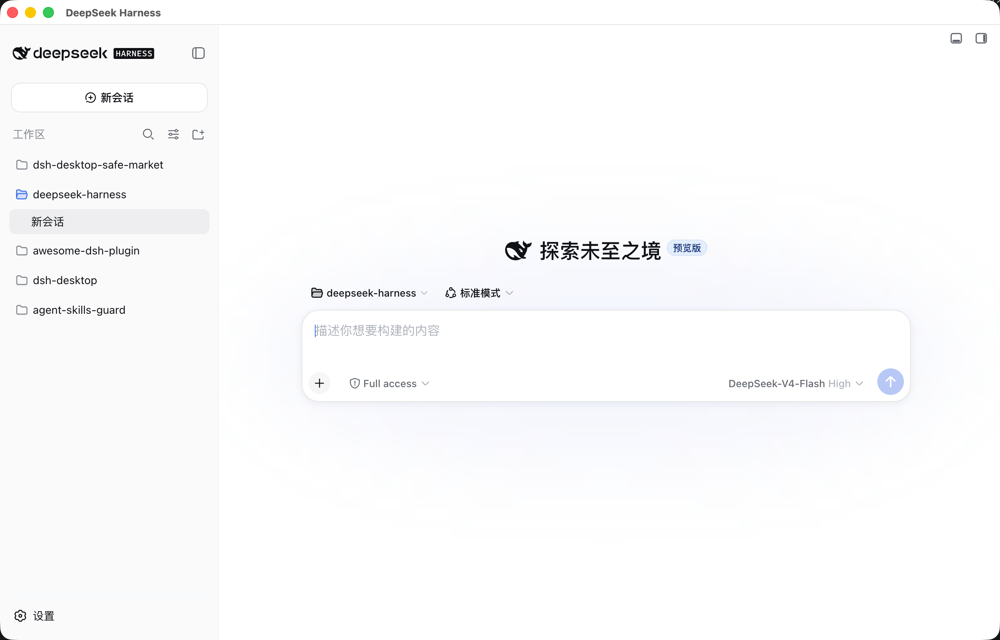
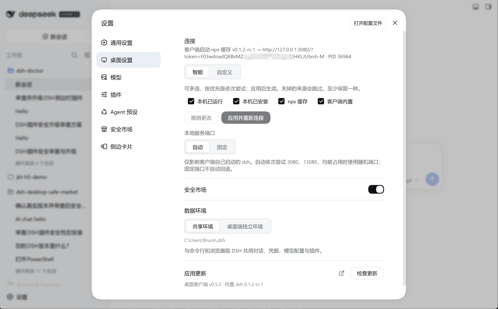
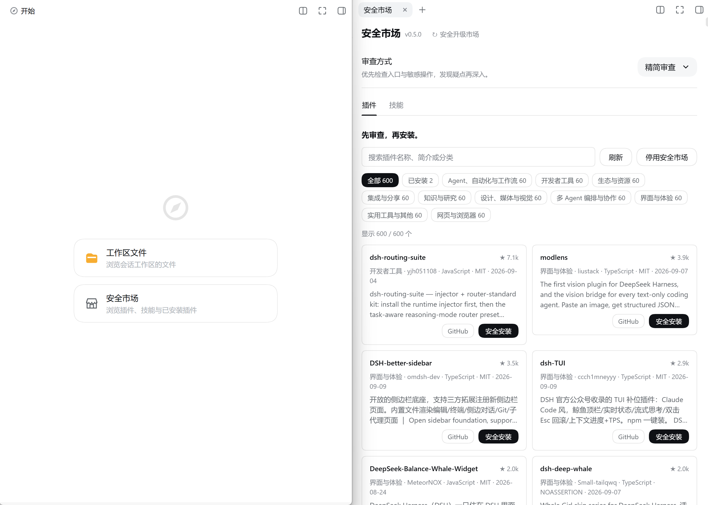

# DSH Desktop

中文 | [English](README_EN.md)

**第三方 DSH 桌面客户端。使用官方 Web UI，支持后台运行、系统通知、运行时切换和内置安全市场。**

DSH Desktop 是独立的 DeepSeek Harness（`dsh`）Electron 客户端。窗口直接加载官方 Web UI；桌面端负责运行时启动与连接、托盘、通知、更新和安全控制。

> [!IMPORTANT]
> **这是社区维护的非官方项目。** 本项目不是 DeepSeek 官方产品，也不代表 DeepSeek。`DeepSeek`、`DeepSeek Harness`、`dsh` 及相关名称和标识归各自权利人所有。

安装包内置固定版本的官方 `@deepseek-ai/dsh` 运行时，启动客户端和使用内置运行时无需另行安装 Node.js、pnpm 或 `dsh` CLI。具体任务或插件仍可能需要额外工具。桌面客户端和官方运行时使用不同版本号，连接设置会同时显示这两个版本。



## 主要功能

- 关闭窗口后继续在后台运行，可从托盘或菜单栏重新打开。
- 直接使用官方 Web UI，不维护另一套界面。
- 安装包内置官方运行时，可直接启动。
- 可复用正在运行的 dsh，也可使用 PATH、npx 缓存或内置运行时。
- 可选择与 CLI 共享 `~/.dsh`，或使用桌面端独立数据环境。
- 内置安全市场。插件目录默认关闭，用户启用后才联网读取；“安全安装”通过提示词要求 Agent 先审查再安装。
- 更新包安装前校验 SHA-256。
- Electron 窗口启用沙箱和上下文隔离，并限制导航与权限。

## 快速开始

### 下载安装

从 [GitHub Releases](https://github.com/bruc3van/dsh-desktop/releases) 下载对应系统的安装包。发布版已经包含官方 dsh 运行时，首次启动不会执行 npm 安装。

当前发布流程提供 macOS Apple Silicon、macOS Intel 和 Windows x64 安装包。Linux 暂不提供预构建安装包，可参照开发指南从源码运行。

当前安装包尚未完成正式开发者签名认证，首次打开时系统可能拦截。

**首次打开被系统拦截时**

- **macOS**：将应用拖入“应用程序”并打开。然后前往“系统设置 → 隐私与安全性”，点击“仍要打开”。

  如果系统提示“已损坏，无法打开”，并且没有“仍要打开”按钮，可在终端执行：

  ```sh
  xattr -dr com.apple.quarantine "/Applications/DSH Desktop.app"
  ```

- **Windows**：在 Microsoft Defender SmartScreen 中点击“更多信息”，再点击“仍要运行”。

### 开始对话

1. 首次启动时输入 API Key，或选择“稍后配置”。
2. 没有 Key 时，可打开 <https://platform.deepseek.com/api_keys> 创建。账户、余额和费用由 DeepSeek 开放平台管理。
3. 根据需要选择 Agent 预设或模型。
4. 添加并选择项目文件夹，作为会话的工作区。
5. 新建会话并发送任务。

> [!TIP]
> 全新数据目录可能默认显示英文。可在 **Settings → General → Language** 中切换语言。

## 连接方式

| 模式 | 行为 |
|---|---|
| **智能模式**（默认） | 按顺序尝试：正在运行的官方实例 → PATH 上的 `dsh` → npx 缓存 → 内置运行时。 |
| **自定义** | 连接指定的 Web UI 地址，不启动本地运行时。 |

智能模式只使用本机已有的运行时，不下载或安装 Node.js。连接设置可关闭任一来源，但至少保留一种。独立数据环境不复用共享环境中已运行的实例，需保留本机已安装、npx 缓存或内置运行时之一。来源选择先暂存，点击“应用并重新连接”后生效；也可撤销未应用的更改。

客户端启动本地服务时，自动尝试 3080、13080，再使用系统分配的端口。也可以设置固定端口。固定端口被占用时不会自动换端口。

共享数据环境下，如果客户端检测到官方实例仍在运行，但当前设置不允许复用，会拒绝另起进程，也不会结束用户启动的进程。请先在终端停止该实例，或切换到独立数据环境。

可从托盘菜单、macOS 应用菜单或主窗口快捷键打开“桌面设置”：macOS 使用 `Cmd+,`，Windows/Linux 使用 `Ctrl+,`。



连接状态说明：

| 状态 | 含义 |
|---|---|
| 本机已运行 | 复用用户启动的实例 |
| 客户端启动·客户端内置 | 使用安装包内置运行时 |
| 客户端启动·npx 缓存 | 使用 npx 缓存运行时 |
| 客户端启动·本机已安装 | 使用 PATH 上的 `dsh` |
| 自定义地址 | 连接指定地址，不启动运行时 |

客户端启动的 Web UI 使用本机回环地址。自定义地址可连接自行维护的 Web UI，认证和网络可达性需由该部署保证；地址按协议、主机和端口保存，不保留路径、查询参数或片段。跨机器连接的部署方式请参照所用版本的[官方文档](https://github.com/deepseek-ai/deepseek-harness)。

运行时选择、端口和认证细节见[开发指南](docs/development.zh.md#从源码运行)。

## 数据与安全

| 数据 | 默认位置 | 管理方 |
|---|---|---|
| 共享环境的会话、凭据、模型配置和插件 | `~/.dsh` | 官方 dsh |
| 桌面端设置、命令 shim 和更新下载 | `~/.bruc3van-dsh-desktop` | 桌面客户端 |
| 独立环境的会话、凭据、模型配置和插件 | `~/.bruc3van-dsh-desktop/dsh` | 官方 dsh |

设置中的“数据环境”可以在共享环境和桌面端独立环境之间切换，重启后生效。切换不会复制原环境中的会话或插件。

旧版 `~/.dsh-desktop` 会在新目录不存在时迁移到 `~/.bruc3van-dsh-desktop`。移动失败时会复制数据并保留旧目录。

主要安全措施：

- 通过官方 `dsh web` CLI 启动服务，通过 Web UI 的 `/api` 接口交互；内置市场接入还会调用运行时的配置加载模块并调整插件配置。
- Electron 启用沙箱和上下文隔离，关闭 Node 集成。
- 页面导航限制在当前 Web UI 源站，外部链接使用系统浏览器打开。
- 打包版本默认忽略覆盖更新源、数据目录或连接探测设置的环境变量；显式启用不安全调试模式时例外。
- 更新清单和安装包文件名会进行校验，安装包会校验 SHA-256。
- 客户端管理的本机 Web UI 可使用文件选择、语音输入等权限；复用的实例和自定义地址采用更受限的权限策略。跨域子框架、USB/HID/串口、定位、屏幕捕获和存储权限升级默认拒绝。
- 安全市场的插件目录默认关闭，用户启用后才联网读取。

Windows 安装版支持系统通知。Linux 使用 Chromium 通知。当前 macOS 包没有正式签名，因此系统通知会降级为 Dock 角标、Dock 弹跳和应用内提醒。

使用本客户端仍需遵守 DeepSeek、模型提供方和所连接服务的条款与隐私政策。API Key、模型请求、费用、生成内容以及 Agent 对本机文件和命令的操作由用户和对应服务负责。

## 桌面端行为

- 关闭主窗口后继续后台运行；从托盘或菜单栏可重新打开。
- “重启客户端”会重启客户端管理的本地运行时，不会结束用户在终端启动的 `dsh web`。
- 本地 Web UI 意外退出时会进行有限次数的重启。
- 系统唤醒或长时间后台运行后，页面异常时会在服务可用后重新加载。
- 智能模式复用的实例失联时，可回退到其他已启用来源。自定义地址失败时不会自动切换。
- 客户端通过运行时锁和本机服务探测，避免为同一 `DSH_HOME` 重复启动运行时。无法安全接管或停止旧进程时，会拒绝启动新进程；这些检查不能阻止用户从其他终端或工具启动额外实例。
- 共享环境因插件失败而无法启动时，可卸载确认存在的问题插件后重试，或保留插件并切换到独立环境。

发布版启动后会检查 GitHub Releases，12 小时内不重复自动检查。也可从设置、托盘菜单或 macOS 应用菜单手动检查。更新窗口显示下载、校验和安装状态；下载失败可重试，关闭窗口后下载可以继续。

macOS 可在应用目录可写时自动替换并重启应用。更新失败时会尝试恢复旧应用。更新会中断客户端管理的本地任务，请选择合适的时间执行。

## 内置运行环境

- 发布版在启动本地运行时时，于 `~/.bruc3van-dsh-desktop/bin` 生成 `node`、`dsh` 和 `pnpm` 命令入口，并将该目录追加到运行时及其 Agent 命令的 PATH。已有 PATH 中的用户工具优先；客户端不修改系统 PATH。
- `node` 使用 Electron 自带的 Node.js 执行能力，`pnpm` 随安装包提供；客户端未内置 `npm` 和 `npx`。如需使用这两个命令，请另行安装包含 npm/npx 的完整 Node.js 发行版，并确保命令在客户端启动的运行时 PATH 中可用。
- 内置 `dsh` 入口支持插件管理、版本查询和配置导出，会拒绝再次启动 `dsh web` 等运行时实例。
- 客户端启动运行时时会清理内部的 `ELECTRON_RUN_AS_NODE` 设置，避免普通 Agent shell 命令误用 Electron 的 Node 模式。
- 应用未启用 macOS App Sandbox。Electron 窗口沙箱不等同于 Agent 命令沙箱；Agent 操作还受所用运行时的权限策略、沙箱配置和操作系统授权约束。
- 内置运行时随客户端发布，不能单独升级。

实现细节见[桌面客户端架构](docs/desktop-client-architecture.zh.md)和[开发指南](docs/development.zh.md)。

## 内置安全市场

[安全市场](https://github.com/bruc3van/dsh-desktop-safe-market)随安装包离线发布。桌面设置中的“启动时接入内置安全市场”默认开启，在客户端启动且依赖兼容的运行时中接入插件，无需在线安装。复用已经运行的本机实例或连接自定义地址时，不改动其插件配置。

市场页面内的“启用安全市场”控制联网读取插件目录，默认关闭，与桌面设置中的接入开关相互独立。用户启用后会保存该选择，并缓存上一次成功获取的数据。关闭桌面设置中的接入开关后，下次由客户端启动运行时时会移除客户端拥有的市场副本及登记；尚未转为客户端管理的用户安装不受该开关管理。

客户端启动本地运行时时，若内置市场版本高于 Web 配置中已启用的普通安装版或官方仓库的 GitHub release tag 安装版，会离线升级并转为客户端管理，同时移除旧的依赖固定和 pnpm 锁文件入口。相同或更高版本、其他自定义来源（如 file/link/git）、无法识别的版本或锁文件会保留；连接已有服务时不会替换。迁移后的市场随客户端更新，也受客户端的内置市场开关管理。

依赖预检以本次启动的运行时为准：旧共享目录中自动链接的可选依赖，如果本次运行时不提供，不会阻止内置市场加载。必需依赖和用户显式安装的依赖仍会检查兼容性。

客户端设置中的“启动时接入内置安全市场”控制下次启动的行为，旁边单独显示本地安装和登记状态，不代表当前会话已加载。市场自卸载后，当前会话可能仍保留界面；开关开启时，下次客户端启动本地服务会尝试恢复内置副本，关闭时不会恢复。未清理的用户安装会显示提示，不会被当作已恢复。

从开始页打开「安全市场」，可在右侧浏览插件目录，按名称或分类筛选，并查看已安装插件。




市场目录来自 [awesome-dsh-plugin](https://github.com/bruc3van/awesome-dsh-plugin)：

- 每日采集带 `dsh-plugin` 标签的仓库。
- 排除已归档、停用或不符合收录条件的项目。
- 使用人工维护的排除名单，并在展示前再次校验数据。

“安全安装”不会直接执行安装命令。它会在新会话中填入安全审查提示词，但不会自动发送。用户发送后，提示词要求 Agent 检查凭据访问、数据外传、远程代码执行、安装脚本、混淆文件和权限范围；审查通过后可继续使用官方命令安装，遇到可疑内容或安装审批要求时再停下询问。发送提示词即授权这套审查及安装流程，并非审查后必有第二次确认。

**收录不代表安全背书。安装前仍需查看审查结果。**


已安装插件可以查看版本、启用、停用或卸载。已安装但未加载的插件也会显示。


市场与当前运行时不兼容时，客户端会停止接入市场，不影响其他插件。更完整的配置、目录协议和限制见[安全市场仓库](https://github.com/bruc3van/dsh-desktop-safe-market)。

## 常见问题

**Q：这是浏览器套壳吗？**

窗口加载官方 Web UI，但客户端还负责运行时管理、连接、托盘、通知、权限控制和更新。项目不维护另一套产品界面。设计说明见[架构文档](docs/desktop-client-architecture.zh.md)。

**Q：与直接在浏览器访问 Web UI 有什么区别？**

浏览器方式通常需要用户安装 Node.js、启动 `dsh web` 并保持终端运行。桌面客户端内置运行时，可在后台管理服务，并提供托盘、通知、连接设置和应用内更新。

**Q：如何使用最新的官方 dsh？**

可更新 PATH 上的官方 `dsh` 或 npx 缓存运行时，并在智能模式中启用对应来源；也可复用已更新的本机实例，或通过自定义地址连接自行维护的 Web UI。智能模式按来源顺序选择，不会比较所有来源后自动选最新版。内置运行时固定为客户端发布时的版本，通过客户端更新升级。

**Q：安全市场会自动安装插件吗？**

点击“安全安装”只填写审查提示词，不自动发送或安装。用户发送后，Agent 会按提示词先审查，审查通过后可继续安装；发现可疑内容或遇到审批要求时会停下询问。

## 相关项目

- [awesome-dsh-plugin](https://github.com/bruc3van/awesome-dsh-plugin)：安全市场的目录数据来源。每日采集插件仓库并维护排除记录。
- [dsh-desktop-safe-market](https://github.com/bruc3van/dsh-desktop-safe-market)：本客户端内置安全市场的实现。
- [deepseek-harness](https://github.com/deepseek-ai/deepseek-harness)：官方 dsh 和 Web UI 的上游项目。

## 许可证

[MIT](LICENSE)

MIT 许可证只适用于本仓库维护的代码和素材。官方 `@deepseek-ai/dsh` 及其他第三方依赖使用各自许可证。“DSH”仅用于说明兼容对象，不表示官方关系。
