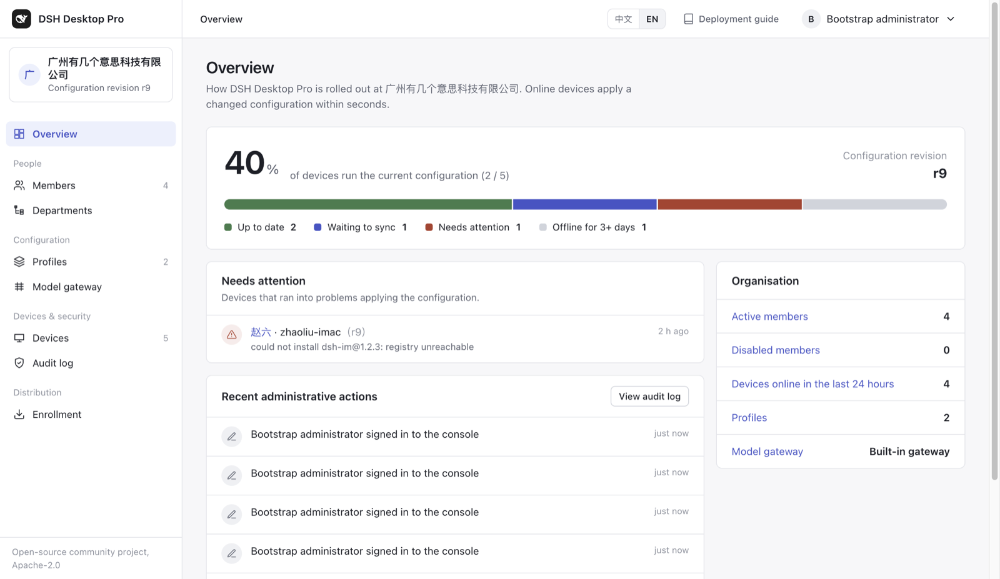

# DSH Desktop Pro

[中文](README.md) | English

**A professional desktop client for DeepSeek Harness (`dsh`), built around organisation-wide configuration. Individuals install it and start working; in a company, IT sets up models, plugins, skills and tool permissions once, and employees sign in and get to work.**

> [!IMPORTANT]
> **This is an unofficial community project.** It is not developed, published, endorsed, or supported by DeepSeek. `DeepSeek`, `DeepSeek Harness`, `dsh`, and related names and marks belong to their respective owners.


The client loads the official Web UI, and the installer includes a pinned version of the official `@deepseek-ai/dsh` runtime, so no separate Node.js or `dsh` CLI is needed. On top of that, the client manages the runtime, the tray, notifications, updates and security controls; the organisation features come from the client together with an open-source management server.

## Secure, collaborative, convenient

**Secure**

- Employees' machines hold only a personal key; the real key for the company's model service stays on the management server.
- When an employee is disabled, their personal key stops working at once and their device removes the organisation's configuration.
- IT can disable specific tools. Disabled tools are not offered to the model, and blocked calls are recorded in the audit log.
- Each audit record is chained to the previous one, so edited or deleted records can be detected.
- Configuration sent to clients is signed and verified before it is applied; update packages are checked against SHA-256 before installation.
- Electron windows run sandboxed with context isolation, and navigation and permissions are restricted.

**Collaborative**

- Profiles bundle models, plugin indexes, skills and tool permissions, and are assigned to everyone, a department or a person.
- Online devices apply a changed configuration within seconds.
- The console shows whether each device runs the current configuration, and which devices failed and why.
- Requests, tokens and cost by member, department and model, with a request log you can export for finance.
- Cost or token limits for the company, departments and people; when one is used up, requests are refused or continue on a cheaper model.
- Plugins IT has reviewed go into the company plugin market and appear first on people's Discover page; a risky plugin can be blocked, which removes it from every computer.
- A skill library for the company's skills: install one for everyone, or let people choose in the client.
- The console is available in Chinese and English.

**Convenient**

- Employees install the client and sign in once with their company account; models and plugins are already set up.
- IT can also place a single configuration file instead of running a server.
- The client keeps running in the background after the window closes and reopens from the tray or menu bar.
- On first launch the client subscribes to a curated plugin index you can browse and install from on the Discover page.
- When IT allows it, employees can switch between organisation mode and personal mode.

## Personal and organisation use

| | Personal | Organisation |
|---|---|---|
| Getting started | Enter your own API key | IT provides a configuration; employees sign in with their company account |
| Models | Your own DeepSeek or other model account | The company model gateway, with a personal key per person |
| Plugins and skills | Installed by you | Assigned by IT; people can add their own |
| Data directory | `~/.dsh` or the client's own directory | A separate organisation directory; a personal `~/.dsh` is never touched |
| Deployment | None | One configuration file, or the management server (Docker Compose) |

On a machine without an organisation configuration, the client behaves exactly as for personal use.

## Organisation features



- **File mode**: place one `managed.json` in a system directory; the client opens straight onto the company's model gateway, with plugin indexes, skills and tool restrictions applied. The file can be signed against tampering.
- **Server mode**: run the open-source management server (Docker Compose + PostgreSQL); employees sign in with company SSO (any OpenID Connect provider).
- **Model gateway**: the server's built-in gateway connects to any OpenAI-compatible API, with as many upstreams as you need; LiteLLM can be used instead.
- **Model catalog, usage and limits**: register models and prices, analyse usage and cost by member, department and model, and set limits for the company, departments or people.
- **Plugin market and skill library**: pick and review plugins from public plugin indexes and approve one pinned version for employees; edit the company's skills in one place and deliver them to everyone or on request.
- **Management console**: manage members, departments, profiles and devices, review usage and the audit log, and create the enrollment file employees install.

See the [enterprise deployment guide](docs/enterprise.md).

## Roadmap

These are planned directions and are not available yet; see the [CHANGELOG](CHANGELOG.md) for what has shipped.

- **Visualisation**: more charts of configuration rollout, device status and usage, with custom dashboards.
- **Audit**: more event types, filtering by person, device and action, and exporting audit records.
- **Knowledge sharing within the organisation**: employees submit the skills they write to the company skill library from the client, and colleagues install them once reviewed.
- **Sign-in and directory sync**: Feishu (Lark), DingTalk and WeCom sign-in and directories.

## Download

Download the installer for your system from [GitHub Releases](https://github.com/bruc3van/dsh-desktop-pro/releases). Release builds already contain the official dsh runtime and do not run npm installation on first launch.

| Your device | Package to choose |
|---|---|
| macOS, Apple Silicon (Apple M series) | `mac-arm64.dmg` |
| macOS, Intel | `mac-x64.dmg` |
| Windows, 64-bit Intel/AMD | `win-x64.exe` |
| Linux, 64-bit Intel/AMD | `linux-x86_64.AppImage` |
| Ubuntu 24.04, 64-bit Intel/AMD installer | `linux-amd64.deb` |

These are filename suffixes; the full name also includes the client version. For Linux installation steps and requirements see the [user guide](docs/user-guide.md#install-on-linux-x64).

macOS/Windows packages do not yet have full developer signing and notarization, so the operating system may block the first launch:

- **macOS:** Move the app to Applications and open it. Then go to **System Settings → Privacy & Security** and choose **Open Anyway**. If macOS reports that the app is damaged and does not show **Open Anyway**, run:

  ```sh
  xattr -dr com.apple.quarantine "/Applications/DSH Desktop Pro.app"
  ```

- **Windows:** In Microsoft Defender SmartScreen, choose **More info**, then **Run anyway**.

## Getting started

**Personal use**

1. Enter an API key on first launch, or choose **Configure later**. Create a key at <https://platform.deepseek.com/api_keys> if needed; DeepSeek manages the account, balance, and charges.
2. Choose an Agent preset or model if needed.
3. Add and select a project folder as the conversation's workspace.
4. Start a conversation and send the task.

> [!TIP]
> A fresh data directory may start in English. Change the language under **Settings → General → Language**.

**Employees**

Once IT has placed the configuration, the client shows "Sign in to <company>". Click it, sign in with your company account in the system browser, and return to the client to use the models and plugins your company set up.

## Documentation

- [User guide](docs/user-guide.md): connection modes, data and security, background operation and updates, the bundled runtime, the preset plugin subscription.
- [Enterprise deployment guide](docs/enterprise.md): file mode, server deployment, the model gateway, the console and SSO.
- [Desktop client architecture](docs/desktop-client-architecture.md): process model, trust boundary and design decisions.
- [Development guide](docs/development.md): running from source, verification and releases.

## FAQ

**Q: Can individuals use it?**

Yes. Without an organisation configuration the client is a complete personal desktop client and needs no server.

**Q: Does organisation mode read or change my personal data?**

No. Organisation mode uses a separate data directory and does not read or write a personal `~/.dsh`. After switching back to personal mode, your own sessions and plugins are still there.

**Q: Is this a browser wrapper?**

The window loads the official Web UI, but the client also manages runtimes, connections, the tray, notifications, permissions, updates and organisation configuration. It does not maintain a separate product interface.

**Q: Does the preset subscription install plugins automatically?**

No. The client only adds the index address. Whether and what to install is your choice on the Discover page, and installation is done by the official plugin manager.

## Related projects

- [awesome-dsh-plugin](https://github.com/bruc3van/awesome-dsh-plugin): source of the preset index. It collects plugin repositories daily and maintains exclusion records.
- [safer-dsh-market](https://github.com/bruc3van/safer-dsh-market): a standalone review-before-install market plugin you can install yourself.
- [deepseek-harness](https://github.com/deepseek-ai/deepseek-harness): the upstream project for the official dsh and Web UI.

## License

[Apache-2.0](LICENSE)

From 0.6.0 this repository is licensed under the Apache License 2.0; releases up to and including 0.5.29 remain under the MIT License. The license covers only code and assets maintained in this repository. Official `@deepseek-ai/dsh` and other third-party dependencies use their own licenses. “DSH” identifies the compatible product and does not imply an official relationship.
